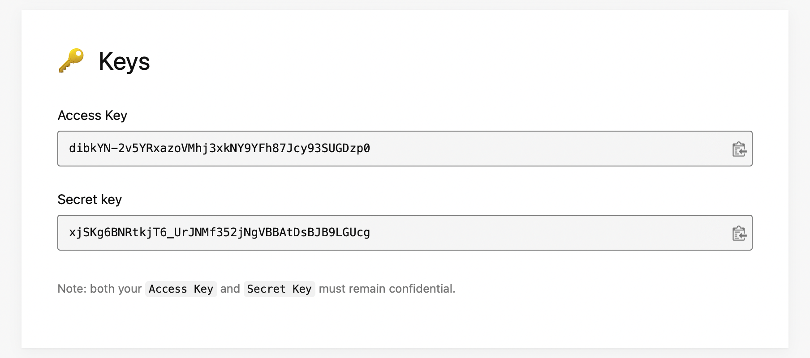

[](./LICENSE)


# Cloud Photo Gallery

A flutter application

## Features
 :white_check_mark: Showcase cloud photos in a gallery\
 ✅ Caches photos for offline use\
 :white_check_mark: Download photos\
 :white_check_mark: Share photos

## Run It

### Prerequisites
How to get `accessKey` as referred in [secrets.dart](/lib/core/secret/secrets.dart)?
 1. Go to [https://unsplash.com/developers](https://unsplash.com/developers)
 2. Create an account and login
 3. Goto `Your apps` section and create an application
 4. Inside your application find `Access Key` (image attached)



 5. Update [secrets.dart](/lib/core/secret/secrets.dart) accordingly

Note: [secrets.dart](/lib/core/secret/secrets.dart) is not version controlled

### Commands

```bash
# Code generation

chmod +x scripts/build_runner.sh
./scripts/build_runner.sh
```
## License

Released under [MIT](/LICENSE) by [@aap01](https://github.com/aap01).


